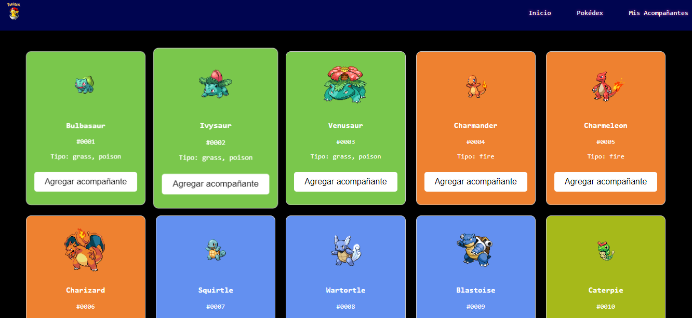
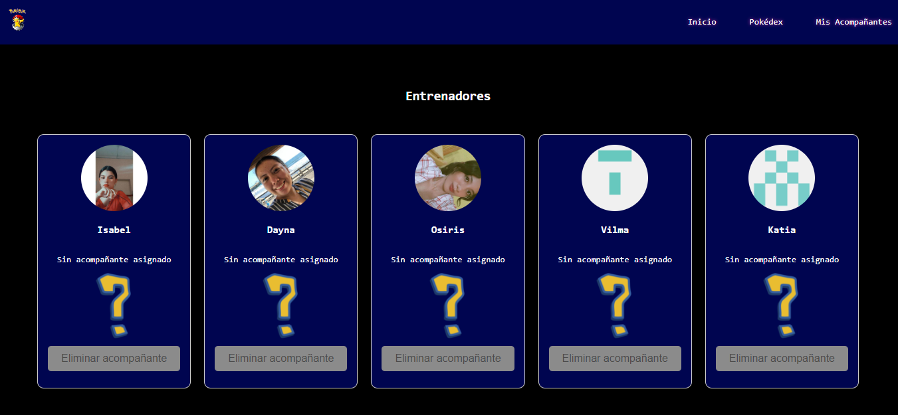

# Pokedex

## Descripción
Este proyecto consiste en una Pokédex donde se meustra la informacion general de 150 pokemons de la primera generación ✨. Cada Pokémon se presenta en una tarjeta individual con información sobre su especie, altura, peso, tipo, habilidades, debilidades, stats, movimientos y una imagen que corresponda al pokemon asignado ✅.

## Detalle sobre su uso

- Las tarjetas son interactivas el usuario puede poder ingresar a ellas y ver toda su información y tomando en cuenta que estas tienen un botón con el cuál el usuario puede seleccionarlo como acompañante.

- Al seleccionar como acompañantes solo puede hacer agregando solamente a 6 pokemons.

- En acompañantes encontrara los pokemons elegidos, y los entrenadores a los cuales puede asignarles un pokemon.

- Cada entrenador cuenta con un boton el cual podra eliminar el acompañante asignado cuando lo desee.

# Tecnologia utilizada
- Html

- JavaScript

- Css

- Api consumida desde la PokeApi

## Autores
- Dayna Rebeca Moreno Santiago - MS21017
- Katia Guadalupe Chévez Campos - CC19036
- Miriam Isabel Castillo Portillo - CP21026
- Osiris Ivania Andrade Campos - AC21059
- Vilma María Gutiérrez Juárez - GJ20005
